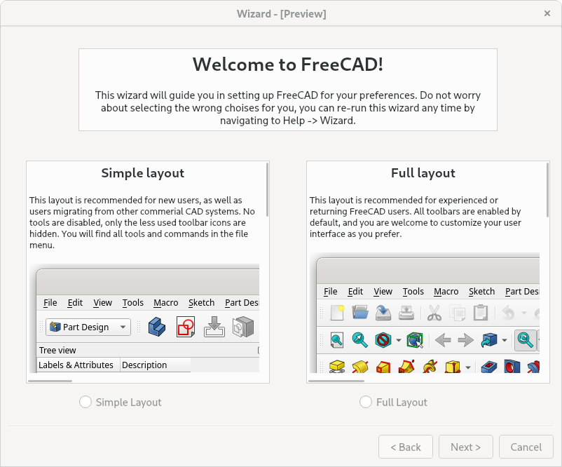
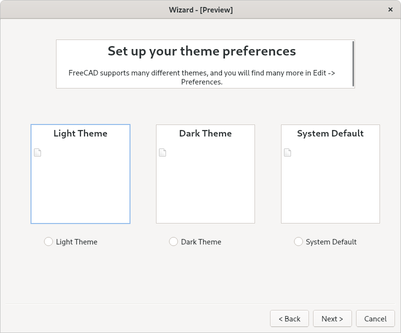
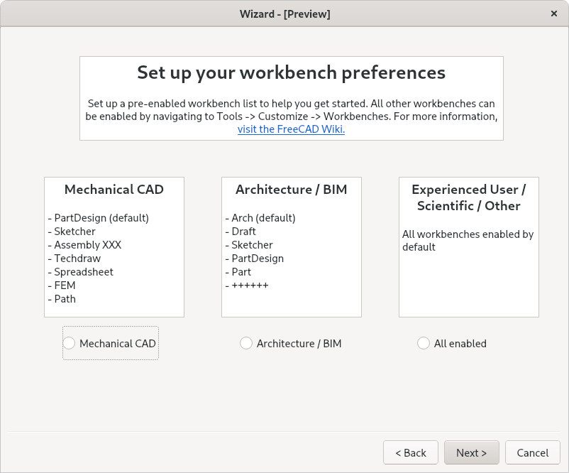
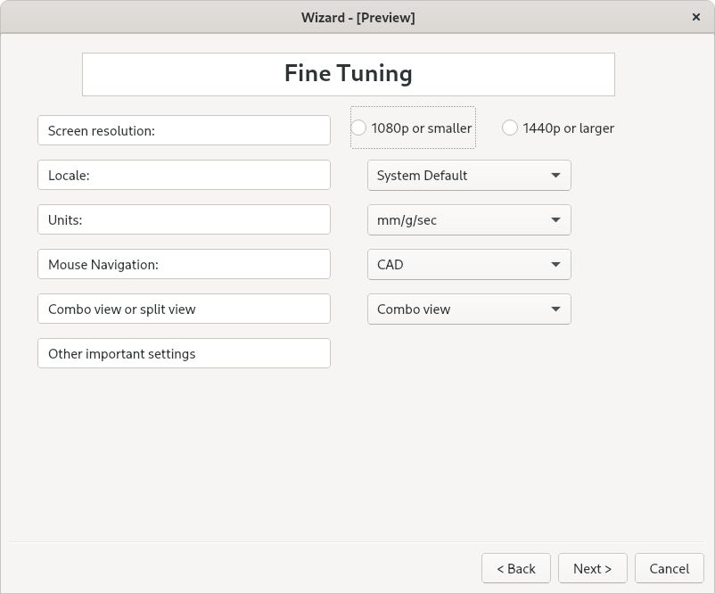
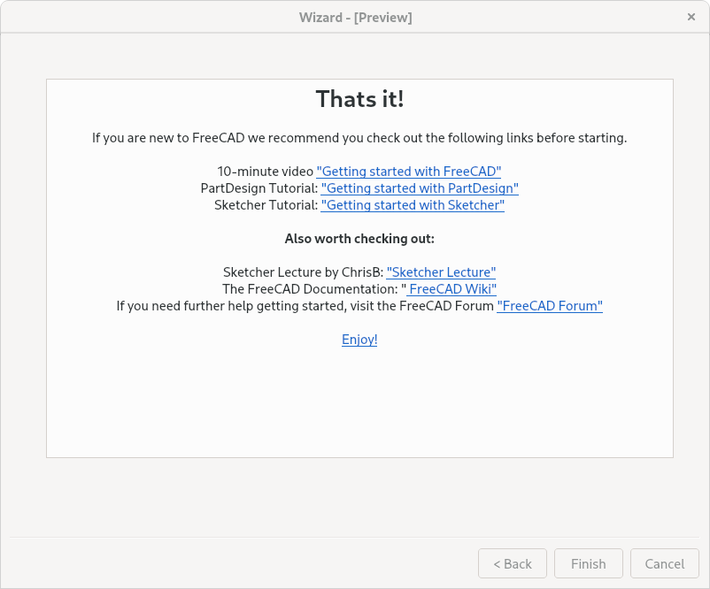

# FreeCAD-Wizard
A "Getting-started-wizard" for FreeCAD, with a goal of flattening the learning curve, and give new users an easier road learning FreeCAD.

[Forum post where the discussion happens.](https://forum.freecadweb.org/viewtopic.php?f=34&t=71277)

Please feel free to modify and add files to this repo as you wish, it is just a temporary repo until this feature is ready to be merged.

## TL;DR
During first startup; lets give users a choice between something like this:  

  

And this:  

  

## Wizard Mockup

Here is a quick mockup of what such a wizard could look like. This is a very rough draft, do not read too much into the details.  

  

  

  

  

  

## Preference Packs / Configuration Files
Any help making proposals for new default configurations would be greatly appreciated.  

Please start with a clean configuration, and create a pull request with your modified `FreeCAD.conf` and `user.cfg` files when you are happy. Create a directory with your files in `/config_files/`, and add a .md or .txt file with a short description of your modifications and rationale.
